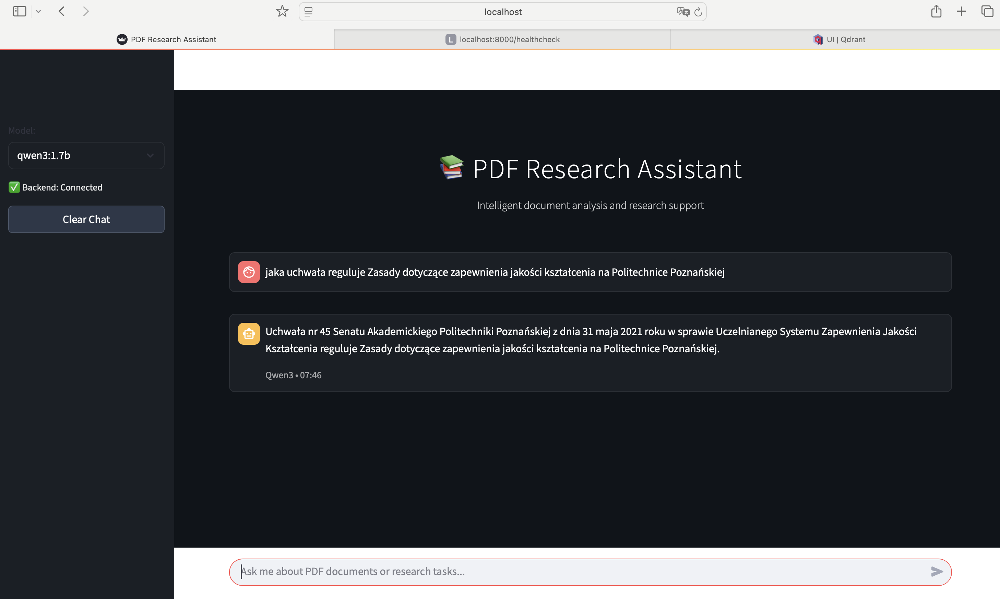
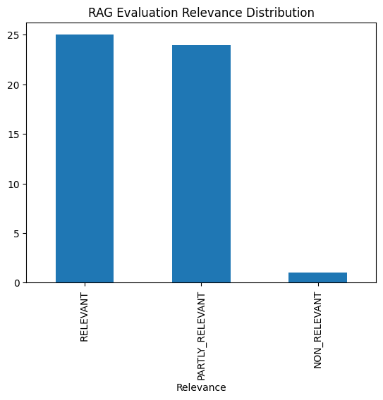
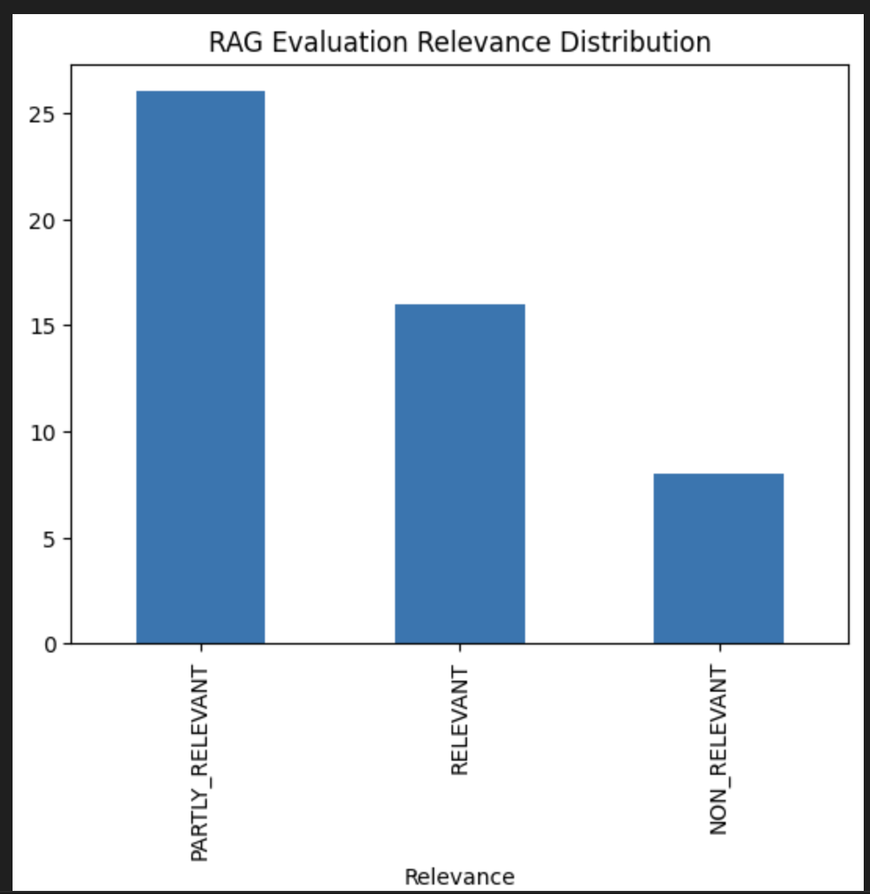

# PDF Research Assistant

1. Problem description
    The PDF Research Assistant is a tool designed to facilitate efficient information retrieval from PDF documents. Users can load PDFs into the data directory or specify URLs in urls.txt for automatic downloading. The system processes these documents, enabling users to ask questions and receive accurate answers based on the content of the PDFs. This solution addresses the challenge of extracting relevant information from large or multiple PDF files, streamlining research and data analysis tasks.

2. Prerequsites
    - Docker and Docker Compose must be installed on your system.
    - Ensure that urls.txt is filled with valid PDF URLs, or manually place PDF files in the data directory.

3. Application start
    To run the application, use the command:

        docker compose up

    PDF data from the data directory is automatically loaded into the Qdrant database. The application will start, and users can interact with the chat frontend to write prompts and receive answers based on the loaded PDFs.

4. Technologies
    - Python 3.13
    - Docker and Docker Compose for containerization
    - Qdrant for full-text search
    - Streamlit for frontend app
    - Fast API as backend api
    - Ollama and qwen3:latest & qwen3:1.7b as LLMs

5. Urls
    Frontend: http://localhost:8501
    Backednd API: http://localhost:8000/healthcheck (healthcheck endpoint used here)
    Qdrant: http://localhost:6333/dashboard#/welcome

    Frontend:
        

6. Code
    Frontend:
        app.py - app frontend code
    Backend:
        injest.py - injestion of data to Qdrant (including chunking)
        pdf_to_qdrant.py - class responsible for pdf to vectors conversion
        qdrant_connector.py - class repsonsbile for Qdrant connection
        rag.py - qdrant retrieval and prompting LLM
        entrypoint.sh - running injestion to Qdrant on container start

7. Evaluation
    Retrieval evaluation -> notebooks/evaluation_retrieval.ipynb
        Model comparison:
            jinaai/jina-embeddings-v2-small-en vs all-MiniLM-L6-v2

            Using jinaai/jina-embeddings-v2-small-en gave definielty better score and answer's order

        Semantic search vs hybrid_search
            for tested dataset hydrib search didn't provide any significat improvemnt, due to siplicity and performance I decided to stay with semantic search

    Rag evaluation:
        1. LLM was used to generate 50 questions based on example pdf file - notebooks/sample_qustions.csv
        2. Rag function was used to generate asnwers
        3. Then question and answer was send to llm using another prompt to judge relevance (LLM as judge)
        4. Two qwen small llm models evaluation - qwen3:1.7b, qwen3:latest

    qwen3:1.7b

      

    qwen3:latest
 
      

    Overally, smaller model perofmed better in that case.

8. Future improvements
    1. Focusing of permormance, get faster response from LLM
    2. Adding monitoring using Grafana