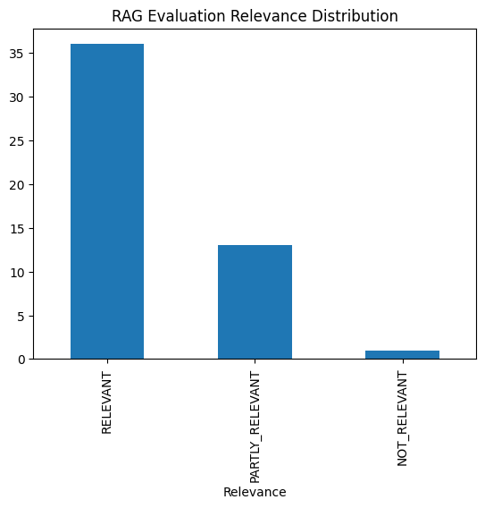

# PDF Research Assistant

---

## 📝 Problem Description

The **PDF Research Assistant** is a tool designed to facilitate efficient information retrieval from PDF documents. Users can load PDFs into the `data` directory or specify URLs in `urls.txt` for automatic downloading. The system processes these documents, enabling users to ask questions and receive accurate answers based on the content of the PDFs. This solution addresses the challenge of extracting relevant information from large or multiple PDF files, streamlining research and data analysis tasks.

---

## ⚙️ Prerequisites

- **Docker** and **Docker Compose** must be installed on your system.
- Ensure that `urls.txt` is filled with valid PDF URLs, or manually place PDF files in the `data` directory.

---

## 🚀 Getting Started

To run the application, use:

```bash
docker compose up --build
```

- PDF data from the `data` directory is automatically loaded into the Qdrant database.
- The application will start, and users can interact with the chat frontend to write prompts and receive answers based on the loaded PDFs.
- Data ingestion is handled by the Python script `injest.py` (in the `backend` directory).
- LLM models (`qwen3:latest` & `qwen3:1.7b`) are downloaded during container initialization.

---

## 🛠️ Technologies Used

- **Python 3.13**
- **Docker** & **Docker Compose**
- **Qdrant** (full-text search)
- **Streamlit** (frontend)
- **FastAPI** (backend API)
- **Ollama** & **qwen3:latest** & **qwen3:1.7b** (LLMs)
- **Postgres 13**
- **Grafana**

---

## 🌐 Service URLs

- **Frontend:** [http://localhost:8501](http://localhost:8501)
- **Backend API:** [http://localhost:8000/healthcheck](http://localhost:8000/healthcheck)
- **Qdrant:** [http://localhost:6333/dashboard#/welcome](http://localhost:6333/dashboard#/welcome)
- **Grafana:** [http://localhost:3000](http://localhost:3000)

Frontend Preview:


---

## 📦 Code Structure

**Frontend:**
- `app.py` — Streamlit app frontend code

**Backend:**
- `injest.py` — Data ingestion to Qdrant (including chunking)
- `pdf_to_qdrant.py` — PDF to vectors conversion
- `qdrant_connector.py` — Qdrant connection logic
- `rag.py` — Qdrant retrieval and LLM prompting
- `entrypoint.sh` — Runs ingestion to Qdrant on container start
- `db.py` - Postgres sql related stuff for monitoring purposes
- `app.py` - main backend app logic

---

## 📊 Evaluation

**Retrieval Evaluation:** ([notebooks/evaluation_retrieval.ipynb](notebooks/evaluation_retrieval.ipynb))
- Three libraries considered for PDF extraction: `pdf_plumber`, `PyMuPDF`, and `pypdf`.
- Highest relevance achieved with `pdf_plumber`, selected as the main extractor.

**Model Comparison:**
- `jinaai/jina-embeddings-v2-small-en` vs `all-MiniLM-L6-v2`
- `jinaai/jina-embeddings-v2-small-en` gave better scores and answer order.

**Semantic Search vs Hybrid Search:**
- For the tested dataset, hybrid search did not provide significant improvement. Semantic search was chosen for simplicity and performance.

**RAG Evaluation:**
1. LLM generated 50 questions based on a sample PDF ([notebooks/sample_qustions.csv](notebooks/sample_qustions.csv)).
2. RAG function generated answers.
3. Question and answer were sent to LLM for relevance judgment (LLM as judge).
4. Two Qwen small LLM models evaluated: `qwen3:1.7b`, `qwen3:latest`.

**qwen3:1.7b**


**qwen3:latest**



Overall, the smaller model performed better in this case.

---

## 🐳 Containerization

Fully containerized using Docker & Docker Compose.

---

## 📈 Monitoring

- Each LLM response is judged in a separate thread — response is completed, relevance is examined in the background (see `backend/app.py`).
- Each response is saved as a record in the Postgres `conversations` table.
- Data is visualized on the dashboard — `pdf_research_assistant`.


### Grafana Dashboard Panels

1. **Last 5 Conversations (Table):** Five most recent conversations, including question, answer, relevance, and timestamp.
2. **Relevancy (Gauge):** Gauge chart for response relevance, with color-coded thresholds.
3. **Model Used (Bar Chart):** Bar chart showing count of conversations by model used.
4. **Response Time (Time Series):** Time series chart for conversation response times.

### Setting up Grafana

All Grafana configurations are in the [`grafana`](grafana/) folder:

- [`init.py`](grafana/init.py) — Initializes datasource and dashboard.
- [`dashboard.json`](grafana/dashboard.json) — PDF Research Assistant dashboard.

To initialize the dashboard, ensure Grafana is running (it starts automatically with `docker-compose up`).

Then run:

```bash
python3 -m venv .venv
source source .venv/bin/activate ##(on Mac / Linux ) on Windows .venv\Scripts\activate
pip install requests dotenv
cd grafana
python init.py
```

Make sure you have installed `requests` & `dotenv` libraries. You can use `uv` dependencies from `pyproject.toml`.

Go to [localhost:3000](http://localhost:3000):

- **Login:** `admin`
- **Password:** `admin`

When prompted, keep "admin" as the new password.

---

## 🚀 Future Improvements

1. Focus on performance: faster LLM responses
2. Automate Grafana resource setup